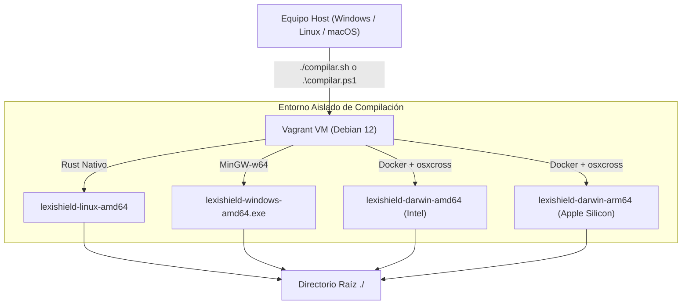

# LexiShield

**LexiShield** es una herramienta de alto rendimiento desarrollada en Rust para la detección, anonimización y sanitización de datos confidenciales, identidades, credenciales y secretos en diversos formatos de archivo (JSON, XML, Texto plano y Logs).

---

## 🚀 Sistema de Compilación Multiplataforma Centralizado

El proyecto incluye un entorno de compilación hermético basado en **Vagrant (Debian 12 Bookworm)** que permite generar binarios optimizados para **Linux**, **Windows** y **macOS (Intel & Apple Silicon)** desde cualquier sistema operativo host sin requerir compiladores, dependencias ni Docker Desktop instalados en tu máquina local.



---

## 📋 Requisitos Previos

Solo necesitas tener instalado en tu equipo anfitrión:
* [VirtualBox](https://www.virtualbox.org/)
* [Vagrant](https://developer.hashicorp.com/vagrant/downloads)

*(No necesitas instalar Rust, Visual Studio C++, MSVC linkers ni Docker en tu máquina).*

---

## 🛠️ Uso del Compilador

El repositorio incluye dos scripts de compilación interactivos y con soporte para parámetros por línea de comandos:

* **Linux / macOS:** `./compilar.sh [opciones]`
* **Windows (PowerShell):** `.\compilar.ps1 [opciones]`

### 1. Parámetros y Opciones Disponibles

| Parámetro (Linux/Mac) | Parámetro (Windows) | Descripción |
| :--- | :--- | :--- |
| `-a`, `--all` | `-All` (o `-a`) | Compila para **todas las plataformas** (Linux, Windows, macOS Intel y macOS ARM64). |
| `-l`, `--linux` | `-Linux` (o `-l`) | Compila solo para **Linux x86_64** (`x86_64-unknown-linux-gnu`). |
| `-w`, `--windows` | `-Windows` (o `-w`) | Compila solo para **Windows x86_64** (`.exe` via MinGW). |
| `-m`, `--mac` | `-Mac` (o `-m`) | Compila para **macOS** (Intel `x86_64` y Apple Silicon `aarch64`). |
| `-c`, `--clean` | `-Clean` (o `-c`) | Realiza una limpieza completa (`cargo clean` y temporales) antes de compilar. |
| `-u`, `--update` | `-Update` (o `-u`) | **Actualiza la máquina virtual** (`vagrant --provision`) y actualiza el toolchain de Rust (`rustup update`). |
| `-k`, `--keep-vm` | `-KeepVm` (o `-k`) | **Mantiene la máquina virtual encendida** al finalizar la compilación para ejecuciones consecutivas ultrarrápidas. |
| `--native` | `-Native` | Fuerza la compilación local utilizando las herramientas instaladas en el sistema host (sin usar Vagrant). |

---

### 2. Ejemplos de Uso

#### Modo Interactivo (Pregunta qué plataformas compilar)
* **Linux / macOS:**
  ```bash
  ./compilar.sh
  ```
* **Windows:**
  ```powershell
  .\compilar.ps1
  ```

#### Compilar Todo en una sola orden
* **Linux / macOS:**
  ```bash
  ./compilar.sh -a
  ```
* **Windows:**
  ```powershell
  .\compilar.ps1 -All
  ```

#### Limpiar y compilar todo manteniendo la VM encendida
Útil durante jornadas de desarrollo para no esperar el arranque de la VM en cada compilación:
* **Linux / macOS:**
  ```bash
  ./compilar.sh -a -c -k
  ```
* **Windows:**
  ```powershell
  .\compilar.ps1 -All -Clean -KeepVm
  ```

#### Actualizar dependencias y Rust en la VM
Si se han modificado paquetes base o quieres compilar con la última versión estable de Rust:
* **Linux / macOS:**
  ```bash
  ./compilar.sh -a -u
  ```
* **Windows:**
  ```powershell
  .\compilar.ps1 -All -Update
  ```

---

## 💻 Desarrollo Remoto con VS Code

Puedes utilizar la máquina virtual de Vagrant no solo para compilar, sino como un **entorno de desarrollo remoto completo**. Esto garantiza que tu entorno de escritura de código (VS Code) sea idéntico al entorno de compilación, y evita tener que instalar Rust, herramientas de desarrollo o Docker en tu equipo anfitrión.

### Opción 1: Desarrollo Remoto Integrado (Recomendado)
VS Code puede conectarse directamente a la máquina virtual y ejecutar sus extensiones (como `rust-analyzer`) desde dentro.

1. Instala la extensión **Remote - SSH** de Microsoft en VS Code.
2. Extrae la configuración de conexión de Vagrant abriendo una terminal en tu host y ejecutando:
   ```bash
   vagrant ssh-config > vagrant-ssh.config
   ```
3. En VS Code, abre la paleta de comandos (`F1`), selecciona **Remote-SSH: Open SSH Configuration File...** y añade el contenido del archivo generado a tu archivo de configuración de SSH local (ej. `~/.ssh/config`).
4. Presiona `F1`, selecciona **Remote-SSH: Connect to Host...** y conéctate al host de tu VM (por ejemplo, `lexishield-vm` o el nombre que apareciera en el archivo de configuración).
5. Una vez conectado, abre la carpeta `/vagrant` (donde reside el código sincronizado). VS Code te pedirá instalar las herramientas recomendadas (como `rust-analyzer`) en el servidor remoto.

### Opción 2: Desarrollo Local Híbrido
Vagrant sincroniza automáticamente tu carpeta local con `/vagrant` en la VM de forma bidireccional en tiempo real.
1. Edita el código usando VS Code en tu equipo host de forma normal.
2. Utiliza los scripts de Vagrant (`./compilar.sh` o `.\compilar.ps1`) para verificar, formatear y compilar.

---

## 📦 Binarios Generados

Los archivos ejecutables compilados se copian directamente a la raíz del proyecto:

| Archivo | Plataforma Destino | Arquitectura |
| :--- | :--- | :--- |
| `lexishield-linux-amd64` | Linux | 64-bit (x86_64) |
| `lexishield-windows-amd64.exe` | Windows | 64-bit (x86_64) |
| `lexishield-darwin-amd64` | macOS | 64-bit Intel (x86_64) |
| `lexishield-darwin-arm64` | macOS | Apple Silicon (M1/M2/M3/M4 - ARM64) |

---

## 🔄 Ciclo de Vida y Mantenimiento de la Máquina Virtual

* **Apagado automático (`vagrant halt`):** Por defecto, los scripts apagan la máquina virtual al terminar para no consumir memoria RAM ni CPU en tu equipo anfitrión.
* **Encendido manual:**
  ```bash
  vagrant up
  ```
* **Apagado manual:**
  ```bash
  vagrant halt
  ```
* **Destruir la máquina virtual (Liberar espacio en disco):**
  Si deseas borrar por completo el disco virtual para liberar espacio o resetear todo desde cero:
  ```bash
  vagrant destroy -f
  ```
  *(La próxima vez que compiles, Vagrant volverá a construir y configurar la máquina virtual de manera automática).*

