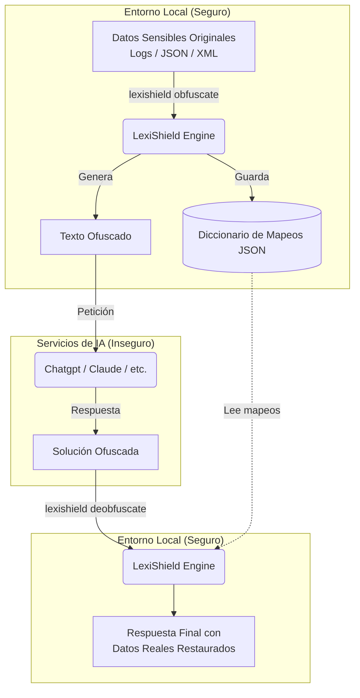

# LexiShield - Motor de ofuscación semántica para consultas de IA y gestión de mapeos

## 📖 Una historia técnica: Aria, los modelos de IA y el escudo de privacidad

En la era dorada de los Modelos de Inteligencia Artificial (LLMs), **Aria** trabajaba como analista de sistemas y desarrolladora en una gran corporación de telecomunicaciones. Su día a día consistía en resolver complejos errores en los servidores de la empresa. Para acelerar su trabajo, Aria utilizaba asistentes de IA, pasándoles volcados de bases de datos, fragmentos de código, archivos de configuración de Active Directory y archivos de log gigantescos para que la IA le explicara los fallos y sugiriera parches.

Pero un día, el oficial de seguridad del reino de la corporación emitió una advertencia:
> *“Queda terminantemente prohibido subir datos reales de producción a servicios externos de IA. Si un log contiene la IP de un cliente, su correo real, un identificador SID de Windows o una contraseña de base de datos, estarás vulnerando la privacidad de millones de usuarios”.*

Aria se vio ante un dilema: renunciar a la velocidad que le daban los asistentes de IA o arriesgarse a una fuga de datos. Fue entonces cuando descubrió **LexiShield**.

### El escudo inteligente de Aria
Aria integró LexiShield como su puente local y seguro hacia la Inteligencia Artificial. La herramienta funcionaba de la siguiente manera:

1. **Ofuscación semántica inteligente:** Antes de enviar un archivo de log plagado de datos reales a la IA, Aria abría su terminal. El motor de LexiShield escaneaba el documento utilizando expresiones regulares avanzadas, detectando correos electrónicos, IPs, nombres de usuario y dominios.
2. **Generación coherente:** El sistema no ponía asteriscos o tachaduras que confundieran al modelo de lenguaje (ya que la IA necesita saber que tal IP se conecta con tal correo). En su lugar, usaba generadores sintéticos realistas. Una dirección IP real como `192.168.1.104` se transformaba en `192.168.22.84`, y el correo `marta.sanchez@empresa.com` se convertía en `email000001@acme.com`. Todo quedaba registrado de forma segura y privada en un diccionario local de mapeos JSON.
3. **El envío a la IA:** Aria copiaba el texto ofuscado y lo enviaba al chat de la IA.
4. **La respuesta del asistente:** La IA leía el texto y respondía de forma impecable: *"El problema reside en que el usuario user000001 tiene un conflicto de credenciales al intentar acceder al servidor IP000001 mediante el puerto 443"*.
5. **Desofuscación precisa:** Aria tomaba el texto de solución sugerido por la IA y le pedía a LexiShield realizar la desofuscación en sentido inverso pasándole el diccionario. El motor, recorriendo los mapeos de forma estructurada, restauraba de forma exacta los nombres reales, IPs y credenciales corporativas en su máquina local.

¡Aria obtuvo la respuesta exacta mapeada a su entorno real sin que un solo byte de información confidencial saliera de su ordenador!

---

## 🚀 Descripción General

**LexiShield** es una herramienta de consola ultrarrápida desarrollada en **Rust** (con binarios independientes libres de dependencias) diseñada para la ofuscación y desofuscación semántica de datos sensibles en archivos de texto estructurado y no estructurado. Su objetivo primordial es actuar como pasarela de anonimización local y segura para compartir contextos con servicios externos sin riesgo de fugas de información.

El diseño sigue estrictamente los principios **SOLID**, buscando un alto rendimiento y un bajo consumo de memoria gracias a las características intrínsecas de Rust.

### Flujo de Operación (Arquitectura)



---

## 🏗️ Arquitectura de Componentes

El software en Rust se divide en capas modulares bien delimitadas:

* **Presentación (CLI):** Gestiona los argumentos por consola mediante `clap`, proporcionando una experiencia rápida y ergonómica.
* **Motor de ejecución (Engine):** Procesa flujos de datos estructurados. Separa la lógica de reemplazo semántico, gestionando el diccionario en un archivo local JSON o en memoria.
* **Validadores y Detectores (Detectors):** Módulos altamente especializados (`network.rs`, `identity.rs`, `o365.rs`, `windows.rs`) que actúan como núcleo de clasificación, detectando tipos de datos e invocando sus respectivas reglas de validación y generación sintética.
* **Formateadores (Format Adapters):** Soporte nativo y estructurado para adaptar inteligentemente la lectura y escritura según el tipo de archivo (Logs crudos, JSON, XML).

---

##  Interfaz de línea de comandos (CLI)

El binario `lexishield` proporciona una interfaz por consola directa y eficiente. A diferencia de versiones anteriores, esta versión en Rust centraliza las operaciones en tres comandos principales.

### Estructura general de comandos
```bash
# Formato general
lexishield <COMMAND> [OPTIONS]
```

### 1. Comando: `obfuscate`
Ofusca un archivo, texto directo o el portapapeles.

* **`-i, --input <FILE>`**: Archivo de entrada a procesar.
* **`-o, --output <FILE>`**: Archivo de salida donde guardar el resultado.
* **`-t, --text <STRING>`**: Texto directo a procesar (si no se especifica archivo).
* **`-c, --clipboard`**: Procesa de forma atómica el contenido actual del portapapeles y copia el resultado de vuelta.
* **`-f, --format <FORMAT>`**: Formato estructurado (`auto`, `json`, `xml`, `log`, `text`). Por defecto es `auto`.
* **`-s, --save-mappings <FILE>`**: Ruta donde guardar la tabla de mapeos generada en formato JSON para poder revertirla más adelante.

*Ejemplos:*
```bash
# Ofuscar archivo
lexishield obfuscate -i server_logs.json -o logs_seguros.json -s mapeos.json

# Ofuscar directamente lo que tienes copiado en el portapapeles (One-Shot)
lexishield obfuscate -c
```

### 2. Comando: `deobfuscate`
Desofusca un archivo, texto o portapapeles utilizando una tabla de mapeos JSON guardada previamente.

* **`-i, --input <FILE>`**: Archivo de entrada a desofuscar.
* **`-o, --output <FILE>`**: Archivo de salida.
* **`-t, --text <STRING>`**: Texto directo a desofuscar.
* **`-c, --clipboard`**: Desofusca el texto copiado en el portapapeles y lo reemplaza con el texto real.
* **`-m, --mappings <FILE>`**: Archivo JSON obligatorio con los mapeos a aplicar.
* **`-f, --format <FORMAT>`**: Formato de lectura/escritura (`auto`, `json`, `xml`, `log`, `text`).

*Ejemplo:*
```bash
lexishield deobfuscate -i respuesta_ia.txt -o respuesta_real.txt -m mapeos.json
```

### 3. Comando: `scan`
Escanea un archivo, texto o portapapeles y muestra los datos sensibles detectados (para auditoría) sin modificarlos ni ofuscarlos.

* **`-i, --input <FILE>`**: Archivo a escanear.
* **`-t, --text <STRING>`**: Texto a escanear.
* **`-c, --clipboard`**: Escanea directamente el contenido del portapapeles.

### 4. Comando: `watch` (Monitorización en Tiempo Real)
Monitoriza continuamente el portapapeles mediante eventos nativos del sistema operativo y supresión de eco. Cada vez que pulses `Ctrl+C` para copiar un texto, LexiShield lo transformará automáticamente.

* **`-d, --direction <DIRECTION>`**: Dirección de transformación: `obfuscate` (por defecto) o `deobfuscate`.
* **`-m, --mappings <FILE>`**: Archivo JSON opcional para cargar/sincronizar los mapeos generados.
* **`-f, --format <FORMAT>`**: Formato estructural esperado.

*Ejemplos:*
```bash
# Modo guardián: todo lo que copies se ofuscará en vivo antes de pegarlo a la IA
lexishield watch --direction obfuscate -m mapeos.json

# Modo restauración: todo lo que copies de la IA se desofuscará automáticamente
lexishield watch --direction deobfuscate -m mapeos.json
```

### 5. Comando: `dict`
Gestiona manualmente diccionarios de mapeos en formato JSON:

* **`lexishield dict list -m mapeos.json`**: Lista todos los pares registrados.
* **`lexishield dict add -o "usuario.real" -p "user0001" -m mapeos.json`**: Inyecta un par personalizado.
* **`lexishield dict clear -m mapeos.json`**: Vacía el diccionario.

---

## ⚙️ Características Técnicas de Soporte

### Mapeo Semántico e Identificación de Tokens de Privacidad
El motor realiza una identificación precisa de la información sensible mediante un pipeline estricto en Rust:

1. **Escaneo por Expresiones Regulares:** Búsqueda en texto utilizando patrones regex avanzados y optimizados compilados en memoria.
2. **Validación Semántica Adicional:** Filtrado activo para eliminar falsos positivos mediante código (ej. validación matemática rigurosa de identificadores fiscales o validación RFC para direcciones IP).
3. **Clasificación y Reemplazo:** Asignación de la categoría semántica correspondiente priorizando los datos de alta sensibilidad antes de invocar la generación sintética.

#### Detalles de Patrones y Regex Incorporados:
* **IP Address (IPv4 / IPv6)**: Detecta y valida direcciones de red, evitando IPs de loopback genéricas si se desea.
* **Email Address**: Direcciones de correo electrónico standard, generando correos ofuscados manteniendo en lo posible el dominio si fuera necesario u ocultándolo por completo.
* **Windows SID Domain / Account**: Identificadores de seguridad SID de Windows. Consumen una lógica especializada en `windows.rs`.
* **Microsoft 365 / Entra ID**: Detección de cuentas UPN, tokens y accesos organizacionales en `o365.rs`.
* **GUID / UUID**: Identificadores únicos globales transformados criptográficamente.

### 🛡️ Generación Inteligente de Pseudónimos (Mapeo Coherente de Tipos)
LexiShield garantiza que el valor ofuscado generado sea de la misma naturaleza e igual de válido que el original para mantener la coherencia en el análisis de logs. Un UUID será sustituido por un UUID estructuralmente válido diferente; un identificador fiscal español mantendrá su letra de control validada, y una IP conservará el aspecto de una IPv4 o IPv6 según corresponda.

### 📖 Tratamiento de Caracteres Especiales y Formatos Estructurados (XML/JSON)

Para que LexiShield funcione correctamente sin importar cómo estén escritos los archivos, la versión de Rust implementa adaptadores de formato (`json_adapter`, `xml_adapter`, `log_adapter`). 

Cuando se analiza un archivo JSON o XML, el sistema no escanea ciegamente todo el texto rompiendo la estructura de etiquetas. En su lugar, analiza semánticamente los campos de datos y ofusca su contenido preservando estrictamente el esqueleto y la sintaxis del archivo original. Así, puedes subir un JSON ofuscado a una IA y devolverá un JSON completamente válido que luego puedes deserializar en tu código real.

---

## 🛠️ Desarrollo Remoto y Compilación Cruzada Multiplataforma

Dada la exigencia de generar binarios nativos sin alertar a los EDR (antivirus) y la necesidad de compilación cruzada hacia Windows y macOS desde entornos aislados, **el único método oficial de compilación es mediante Vagrant**.

Se ha integrado un sistema de compilación automatizado y aislado que arranca una máquina virtual de Ubuntu, monta un disco ultrarrápido y realiza la generación de los tres binarios (`.exe` de Windows con metadatos incrustados, Linux ELF y macOS Mach-O). 

Para compilar el proyecto en todos los sistemas operativos simultáneamente de forma segura, solo tienes que ejecutar:

**En Linux / macOS:**
```bash
./compilar.sh --all
```

**En Windows:**
```powershell
.\compilar.ps1 -All
```
