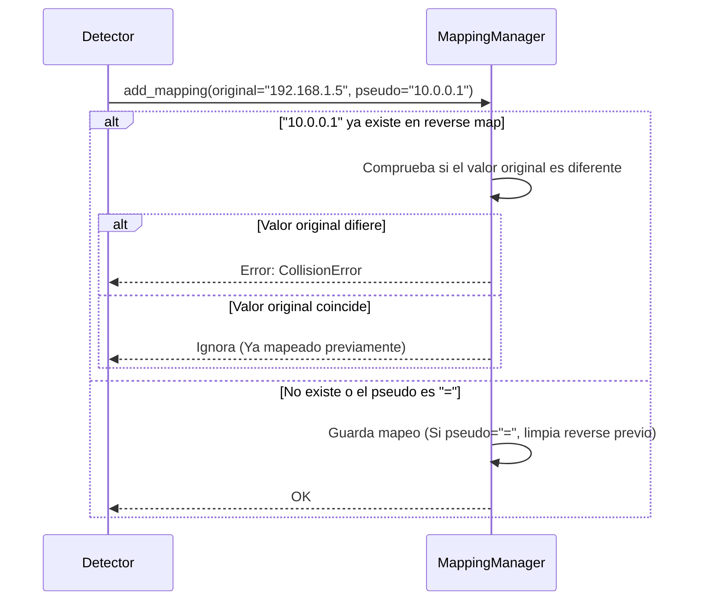
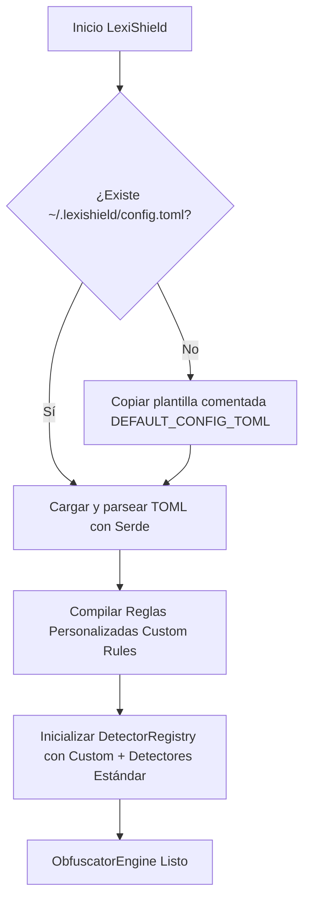

# Arquitectura Interna de LexiShield

Este documento detalla la estructura interna, las decisiones de diseño y el funcionamiento técnico del motor de LexiShield en Rust.

## 🏗️ Arquitectura de Componentes

El software en Rust se divide en capas modulares bien delimitadas:

* **Presentación (CLI):** Gestiona los argumentos por consola mediante `clap`, proporcionando una experiencia rápida y ergonómica.
* **Motor de ejecución (Engine):** Procesa flujos de datos estructurados. Separa la lógica de reemplazo semántico, gestionando el diccionario en un archivo local JSON o en memoria.
* **Validadores y Detectores (Detectors):** Módulos altamente especializados (`network.rs`, `identity.rs`, `o365.rs`, `windows.rs`) que actúan como núcleo de clasificación, detectando tipos de datos e invocando sus respectivas reglas de validación y generación sintética.
* **Formateadores (Format Adapters):** Soporte nativo y estructurado para adaptar inteligentemente la lectura y escritura según el tipo de archivo (Logs crudos, JSON, XML).

---

## ⚙️ Características Técnicas de Soporte

### Mapeo Semántico e Identificación de Tokens de Privacidad
El motor realiza una identificación precisa de la información sensible mediante un pipeline estricto en Rust:

1. **Escaneo por Expresiones Regulares:** Búsqueda en texto utilizando patrones regex avanzados y optimizados compilados en memoria.
2. **Validación Semántica Adicional:** Filtrado activo para eliminar falsos positivos mediante código (ej. validación matemática rigurosa de identificadores fiscales o validación RFC para direcciones IP).
3. **Clasificación y Reemplazo:** Asignación de la categoría semántica correspondiente priorizando los datos de alta sensibilidad antes de invocar la generación sintética.

#### Detalles de Patrones y Regex Incorporados:
* **IP Address (IPv4 / IPv6)**: Detecta y valida direcciones de red, evitando IPs de loopback genéricas si se desea.
* **Email Address**: Direcciones de correo electrónico standard, generando correos ofuscados manteniendo en lo posible el dominio si fuera necesario u ocultándolo por completo.
* **Windows SID Domain / Account**: Identificadores de seguridad SID de Windows. Consumen una lógica especializada en `windows.rs`.
* **Microsoft 365 / Entra ID**: Detección de cuentas UPN, tokens y accesos organizacionales en `o365.rs`.
* **GUID / UUID**: Identificadores únicos globales transformados criptográficamente.

### 🛡️ Generación Inteligente de Pseudónimos (Mapeo Coherente de Tipos)
LexiShield garantiza que el valor ofuscado generado sea de la misma naturaleza e igual de válido que el original para mantener la coherencia en el análisis de logs. Un UUID será sustituido por un UUID estructuralmente válido diferente; un identificador fiscal español mantendrá su letra de control validada, y una IP conservará el aspecto de una IPv4 o IPv6 según corresponda.

### 🧠 Heurísticas Avanzadas de Detección
Para reducir drásticamente los falsos positivos, los detectores aplican inteligencia contextual:
* **Aislamiento de Tarjetas de Crédito:** No solo se valida la longitud y el algoritmo de Luhn, sino que se verifican los caracteres contiguos. Si el número candidato es un fragmento de un hash MD5, un timestamp largo o un nombre de archivo (ej. `attachment_1234.png`), se rechaza. Además, comprueba que el prefijo IIN sea de una franquicia válida.
* **Preservación Estricta de Formato:** Ciertos datos, como los números de teléfono, pueden tener múltiples espaciados o guiones (`+34 600.11-22`). Al ofuscarlos, el motor regenera los dígitos conservando intacta la estructura visual y los prefijos del número original.

### ⚙️ Inyectividad Estricta y Manejo de Omisiones
El sistema gestiona de forma robusta la consistencia de los diccionarios en memoria y en disco:

* **Control de Colisiones (`CollisionError`):** Para asegurar una restauración perfecta, dos valores originales distintos **nunca** pueden apuntar al mismo pseudónimo. El `MappingManager` emplea un índice inverso para rechazar o abortar la inyección si detecta un choque de pseudónimos.
* **Omisión Controlada (`=`):** A través del CLI interactivo, los usuarios pueden excluir detecciones erróneas. Estos elementos se mapean con el pseudónimo literal `=`. LexiShield respeta este marcador de omisión: jamás ofusca esos valores y se encarga de limpiar cualquier índice inverso previo para evitar colisiones fantasma.



### 📖 Tratamiento de Caracteres Especiales y Formatos Estructurados (XML/JSON)

Para que LexiShield funcione correctamente sin importar cómo estén escritos los archivos, la versión de Rust implementa adaptadores de formato (`json_adapter`, `xml_adapter`, `log_adapter`). 

Cuando se analiza un archivo JSON o XML, el sistema no escanea ciegamente todo el texto rompiendo la estructura de etiquetas. En su lugar, analiza semánticamente los campos de datos y ofusca su contenido preservando estrictamente el esqueleto y la sintaxis del archivo original. Así, puedes subir un JSON ofuscado a una IA y devolverá un JSON completamente válido que luego puedes deserializar en tu código real.

---

## 🔐 Cifrado y Bóveda Segura de Mapeos (Vault Autónomo y Portable)

A diferencia de la versión original en Python (que dependía de SQLite con extensiones C compiladas como SQLCipher), LexiShield en Rust implementa un formato de archivo **Vault seguro y autocontenido** desarrollado 100% en Rust puro.

### Decisiones de Diseño y Tecnologías Utilizadas:

1. **Derivación de Claves (KDF): Argon2id (`argon2`)**
   - **Qué es:** El algoritmo ganador del Password Hashing Competition, resistente a ataques acelerados por GPU, FPGA y ASICs gracias a su diseño intensivo en memoria y tiempo.
   - **Motivo:** Permite transformar una contraseña humana en una clave criptográfica de 256 bits (32 bytes) de alta entropía con una sal aleatoria única por archivo (`salt` de 16 bytes).

2. **Cifrado Autenticado (AEAD): ChaCha20-Poly1305 (`chacha20poly1305`)**
   - **Qué es:** Cifrado simétrico de flujo de alta velocidad combinado con el autenticador Poly1305 para garantizar tanto confidencialidad como integridad de datos.
   - **Motivo:** Rendimiento excepcional en CPU sin requerir instrucciones AES dedicadas por hardware, junto con verificación estricta contra manipulaciones (si la contraseña es incorrecta o un byte se corrompe, el descifrado falla inmediatamente sin exponer datos).

3. **Portabilidad y Desacoplo Total:**
   - **Por qué no SQLite/SQLCipher:** SQLCipher requiere enlazar bibliotecas nativas de C (OpenSSL / LibCrypto) en cada sistema operativo de destino, lo que dificulta y fragiliza la compilación cruzada en entornos aislados (Vagrant).
   - **Autocontención entre diferentes usuarios/máquinas:** El archivo cifrado resultante (`.lexi`) encapsula su propio salt y nonce. No depende de credenciales de usuario del sistema operativo (DPAPI de Windows, Keychain de macOS, etc.), por lo que puede ser transferido libremente entre diferentes ordenadores, plataformas y usuarios; basta con conocer la contraseña.

### Estructura del Formato Binario (`.lexi` v1):

```
+-------------------+-----------------+------------------+------------------------------------+
| Magic Header (5B) | Salt KDF (16B)  | Nonce AEAD (12B) | Ciphertext + Poly1305 Tag (Var)    |
| "LEXI\x01"        | Aleatorio OS    | Aleatorio OS     | Payload serializado cifrado        |
+-------------------+-----------------+------------------+------------------------------------+
```

El motor de LexiShield detecta de forma transparente si un archivo de mapeos es un JSON plano estándar o una bóveda cifrada mediante la cabecera `LEXI\x01`, solicitando la contraseña únicamente cuando es necesario.

---

## 🛠️ Ciclo de Vida de Configuración Universal y Reglas Dinámicas (TOML)

Cumpliendo con los estándares de arquitectura, LexiShield desacopla completamente los valores predeterminados del código de las preferencias del usuario mediante un archivo **TOML** (`~/.lexishield/config.toml`).



### Características de la Configuración:
* **Persistencia y Fusión Segura:** Al arrancar, si el archivo no existe en el perfil del usuario, se inicializa automáticamente con ejemplos documentados. Si ya existe, se respetan los valores y las claves nuevas toman valores por defecto sin sobrescribir información del usuario.
* **Motor de Reglas Personalizadas (Custom Rules):** Los usuarios pueden definir expresiones regulares arbitrarias con estrategias de seudonimización sintética (`random_digits`, `random_hex`, `random_alphanumeric`, `prefix_seq`, `mask`) o marcarlas para omisión (`omitted = true`).
* **Control de Exclusiones en Directorios (`[ignore]`):** Filtra recursivamente directorios de dependencias (`node_modules`, `target`, `.git`) y extensiones binarias/multimedia para acelerar drásticamente los escaneos de auditoría.
* **Capacidad de Restablecimiento (`lexishield config reset`):** Permite restaurar de forma controlada la configuración base recomendada.


---

## 🚀 Paralelización Multihilo y Observabilidad

LexiShield ha sido diseñado para escalar al procesar grandes volúmenes de datos, cumpliendo estrictamente con los estándares de agentes y fiabilidad:

### ⚡ Paralelización Extrema (`rayon` e `indicatif`)
Cuando se ejecuta el comando `scan` sobre un directorio completo en modo automático (`-y`), LexiShield reparte de manera balanceada los archivos descubiertos entre **todos los núcleos lógicos de la CPU**. Esto se logra iterando los archivos mediante `par_iter()` de la librería `rayon`. Cada hilo instancia localmente el motor de reglas y ofusca su bloque, reuniendo las detecciones al finalizar de forma segura para resolver las posibles colisiones mediante el `MappingManager` sin bloquear la concurrencia. Todo el progreso se visualiza en tiempo real mediante barras concurrentes profesionales de `indicatif`.

### 📊 Telemetría y Logs Estructurados
Cumpliendo con la regla 5 de arquitectura (*Universal Logging & Observability*), LexiShield prohíbe el uso de comandos de impresión puros (`println!`) para la lógica o depuración interna. En su lugar, el sistema entero está instrumentado con `log` y `env_logger`. Por defecto, se ejecutan en modo silencioso. Al utilizar el flag global `-v` (o `--verbose`), el entorno inicia el nivel en `Debug`, mostrando tiempos de parseo en milisegundos, colisiones inyectivas detectadas en tiempo real y detalles sobre la derivación criptográfica de las bóvedas de contraseñas.

### 🛡️ Robustez y Fuzz Testing (`cargo fuzz`)
Para asegurar la estabilidad absoluta ante cualquier entrada (basura, archivos binarios corrompidos disfrazados de texto, payloads de inyección regex), el motor central y todos sus parsers han sido instrumentados para pruebas de penetración (Fuzz Testing) utilizando `cargo fuzz` y LLVM libFuzzer. Esto garantiza matemáticamente que el motor de ofuscación de LexiShield no crasheará (panic) y operará dentro de límites controlados de memoria, proporcionando un nivel de software resiliente apto para análisis de logs forenses.

### 🧪 Suite de Pruebas y Cobertura de Código (`cargo-tarpaulin`)
La base de código incluye una suite integral de 31 pruebas automatizadas (22 pruebas unitarias por componente y 9 pruebas de integración de extremo a extremo) que cubren:
* Validación de algoritmos de suma de comprobación (Luhn para tarjetas de crédito, módulo 23 para DNI/NIE español).
* Preservación de sintaxis y claves en JSON y etiquetas XML.
* Inyectividad estricta y detección de colisiones de mapeos.
* Cifrado y descifrado de bóvedas (`.lexi`) con autenticación de integridad.
* Detección y filtrado de más de 150 stopwords en español e inglés.

La cobertura de código se mide automáticamente en el pipeline de CI/CD mediante `cargo-tarpaulin`, generando informes Cobertura XML y reportes visuales HTML en `dist/coverage/`.

### ⏱️ Benchmarking de Rendimiento y Throughput (`criterion`)
Para auditar la velocidad de procesamiento y prevenir regresiones de rendimiento, LexiShield implementa una suite estadística de benchmarks con `criterion`:
* **`Engine_Scanning`**: Mide el *throughput* (MB/s) escaneando y extrayendo entidades sensibles en cargas de 100 y 1.000 líneas de logs.
* **`Engine_Obfuscation`**: Mide los nanosegundos por operación al reemplazar tokens sobre texto plano, JSON estructurado y XML.
* Ejecución: `cargo bench` genera análisis estadísticos y curvas de densidad en `target/criterion/`.

### 📦 Optimización de Tamaño del Binario (`profile.release`)
El perfil de producción (`[profile.release]`) aplica técnicas avanzadas de compilación para generar un ejecutable ultra-ligero de apenas **~3.2 MB** (frente a los >15 MB habituales en Rust sin optimizar):
* **`opt-level = 3`**: Máxima vectorización y optimización de bucles.
* **`lto = true`** *(Link-Time Optimization)*: Análisis inter-módulo de código muerto a nivel global.
* **`codegen-units = 1`**: Permite al compilador optimizar el grafo completo del binario como una única unidad.
* **`panic = "abort"`**: Elimina la tabla de *unwinding* de excepciones.
* **`strip = true`**: Remueve automáticamente todos los símbolos de depuración y metadatos ELF/PE redundantes.

### ⚡ Asignador de Memoria de Alto Rendimiento (`mimalloc`)
Para maximizar el rendimiento concurrente con `rayon` y evitar cuellos de botella por contención de bloqueos (*lock contention*) durante la ofuscación masiva de cadenas de texto, LexiShield utiliza **`mimalloc`** como asignador global de memoria (`#[global_allocator]`), reduciendo la fragmentación y acelerando la asignación dinámica.

### ⌨️ Autocompletado de Shell Integrado (`clap_complete`)
La CLI incluye el comando `lexishield completions <SHELL>` capaz de generar scripts nativos de autocompletado en caliente para:
* `bash`: `eval "$(lexishield completions bash)"`
* `zsh`: `source <(lexishield completions zsh)`
* `fish`: `lexishield completions fish | source`
* `powershell`: `Invoke-Expression (& lexishield completions powershell | Out-String)`
* `elvish`: `eval (lexishield completions elvish | slurp)`

### 🛡️ DevSecOps y Auditoría de Vulnerabilidades (`cargo-audit`)
La seguridad de la cadena de suministro (*Supply Chain Security*) se audita automáticamente en el pipeline de CI/CD mediante `cargo audit` contra la base de datos de avisos de seguridad de RustSec, bloqueando cualquier commit o despliegue si se introduce una dependencia con CVEs conocidos.
