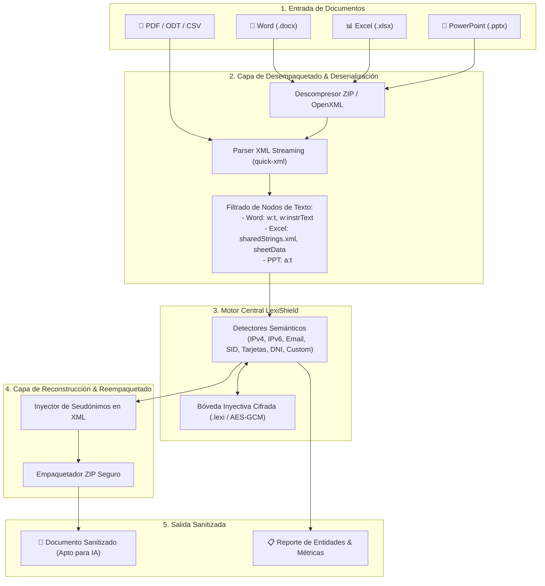

# Especificación Técnica: LexiShield v2.0.0 (Office & Document Engine)

> **Estado**: Planificación / Hoja de Ruta  
> **Versión Objetivo**: `2.0.0`  
> **Módulo Principal**: `lexishield::engine::office`

---

## 1. Visión y Objetivos

La versión **2.0.0** de LexiShield amplía el motor de ofuscación semántica más allá del texto plano, logs y fragmentos de código, incorporando soporte nativo para **documentos ofimáticos de Microsoft Office (DOCX, XLSX, PPTX)** y formatos abiertos (**ODT, ODS, PDF, CSV**).

### Objetivos Clave:
1. **Preservación Estricta del Formato**: Transformar datos confidenciales sin alterar estilos, tipografías, tablas, celdas, saltos de página ni estructuras internas del documento.
2. **Biyección y Reversibilidad Total**: Permitir la restauración bidireccional (desofuscación) de las respuestas generadas por modelos de IA sobre los mismos documentos.
3. **Cero Fugas en Disco**: Procesamiento en memoria (*in-memory streaming*) o uso de buffers seguros efímeros sin dejar copias temporales en claro.
4. **Soporte Multiplataforma**: Implementación 100% Rust sin dependencias de COM de Windows, Microsoft Office instalado ni servicios externos.

---

## 2. Diagrama de Arquitectura del Pipeline de Documentos



---

## 3. Especificación Técnica por Formato

### 3.1 Microsoft Word (`.docx`)
* **Estructura Interna**: Contenedor ZIP con `word/document.xml`, `word/header*.xml`, `word/footer*.xml`, `word/comments.xml` y `word/footnotes.xml`.
* **Nodos Objetivo**:
  * `<w:t>`: Nodos de texto en ejecuciones (*runs*).
  * `<w:instrText>`: Códigos de campo (hipervínculos, metadatos, etc.).
* **Reto Técnico (Fragmentación de Runs)**: Los editores de texto suelen dividir palabras en múltiples runs `<w:r>` tras autocorrecciones o cambios de formato.
  * *Solución*: Unificación lógica del texto del párrafo antes del análisis con mapeo de índices hacia los runs originales.

### 3.2 Microsoft Excel (`.xlsx`)
* **Estructura Interna**: `xl/sharedStrings.xml` y `xl/worksheets/sheet*.xml`.
* **Nodos Objetivo**:
  * `<t>` en `sharedStrings.xml`: Diccionario global de cadenas compartidas de la hoja de cálculo.
  * `<v>` en celdas de tipo texto explícito (`inlineStr`).
* **Preservación de Fórmulas**: Las fórmulas `<f>` se analizan para sustituir literales de texto confidenciales sin romper referencias de celdas (`A1:B10`).

### 3.3 Microsoft PowerPoint (`.pptx`)
* **Estructura Interna**: `ppt/slides/slide*.xml` y `ppt/notesSlides/notesSlide*.xml`.
* **Nodos Objetivo**:
  * `<a:t>` dentro de cuadros de texto, tablas y notas del orador.

### 3.4 Formatos Adicionales
* **PDF (`.pdf`)**: Extracción de texto y análisis forense de entidades confidenciales (con advertencia de solo lectura / generación de resumen).
* **CSV / TSV**: Procesamiento directo con delimitador configurable y detección de cabeceras.

---

## 4. Interfaces de Usuario (CLI & GUI)

### 4.1 Nuevos Comandos en la CLI

```bash
# Ofuscación directa de documento único
lexishield file -i auditoria_2026.docx -o auditoria_sanitizada.docx --vault prod.lexi

# Desofuscación y restauración de documento devuelto por la IA
lexishield file -d -i auditoria_procesada_ia.docx -o auditoria_restaurada.docx --vault prod.lexi

# Procesamiento por lotes sobre una carpeta completa
lexishield batch -i ./reportes_confidenciales/ -o ./reportes_sanitizados/ --ext docx,xlsx --vault prod.lexi

# Escaneo / Auditoría pasiva de un documento sin modificarlo
lexishield scan-file auditoria_2026.docx --format table
```

### 4.2 Integración en la Interfaz Gráfica (GUI)
1. **Zona de Arrastre (*Drag & Drop*)**: El usuario puede arrastrar archivos `.docx`, `.xlsx` o `.pptx` a la pestaña **Studio**.
2. **Visor de Resumen Previo**:
   * Recuento de tablas y párrafos procesados.
   * Lista desglosada de entidades sensibles detectadas con opción de omitir falsos positivos.
3. **Botón de Exportación Directa**: Descarga con un solo clic del archivo sanitizado listo para enviar a ChatGPT / Claude / DeepSeek.

---

## 5. Hoja de Ruta de Implementación (Fases)

| Fase | Hito | Descripción |
| :---: | :--- | :--- |
| **Fase 2.1** | *OpenXML Word Core* | Parser y reempaquetador de `.docx` con soporte de párrafos, tablas y encabezados. |
| **Fase 2.2** | *OpenXML Excel & PowerPoint* | Soporte para `sharedStrings` en `.xlsx` y cajas de texto en `.pptx`. |
| **Fase 2.3** | *CLI `lexishield file / batch`* | Implementación de comandos CLI con barra de progreso interactiva. |
| **Fase 2.4** | *GUI Drag & Drop* | Integración en la interfaz Tauri/Svelte de carga de archivos y previsualización. |
| **Fase 2.5** | *Test Suite & Benchmarks* | Validación con documentos masivos (>100 MB / >50,000 celdas) y verificación de integridad XML. |

---

## 6. Consideraciones de Seguridad y Calidad

1. **Validación de Integridad XML**: Antes de emitir el archivo final, el motor debe parsear el XML de salida para asegurar que es 100% válido y que Word/Excel no emitirán advertencias de "archivo dañado".
2. **Defensa contra XML External Entity (XXE) / Zip Bombs**: El descompresor limitará el ratio de descompresión a un máximo seguro (evitando ataques de descompresión infinita).
3. **Limpieza de Metadatos Ocultos**: Opción configurable (`--strip-metadata`) para limpiar autor original, comentarios eliminados y rutas UNC incrustadas en el documento.

